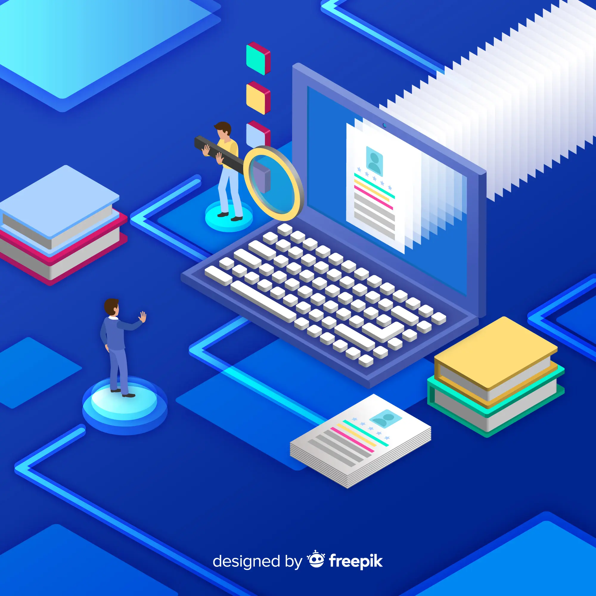

# LLD-repository

  

This repo contains everything that I used and did for learning Low Level Design

## 📌 Fundamental Concepts
- [SOLID Principles with Pictures](https://medium.com/backticks-tildes/the-s-o-l-i-d-principles-in-pictures-b34ce2f1e898)
- [SOLID Principles with Code](https://blog.algomaster.io/p/solid-principles-explained-with-code)
- [DRY Principle](https://blog.algomaster.io/p/082450d8-0e7b-4447-a8dc-b7308e45f048)
- [YAGNI Principle](https://blog.algomaster.io/p/8c3c7da7-885b-4a9c-a6e4-70ee02de4772)
- [KISS Principle](https://blog.algomaster.io/p/21b57678-b351-4ed4-b390-3b6308af2f7d)

## 💭 OOP revision
Please visit the <a href = "https://github.com/KrishnaPrabeeshk/LLD-repository/tree/main/OOP-Revision"> OOP revision </a> for just a brief practice of OOPs concepts before getting into the Design patterns 
